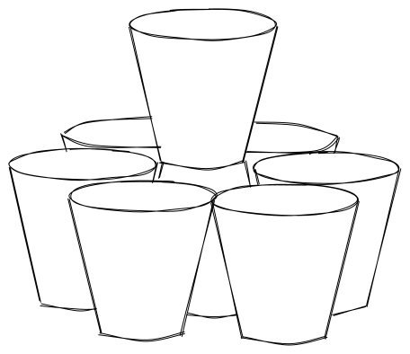

# Chandelier rules

## Preliminary

Chandelier is a drinking game where you will most likely get really drunk. The objective of the game is to be the last man standing, and the way you do that is usually by having the strongest willpower. Your choice of drink should be beer. It is frowned upon (and by default illegal) to drink cider or seltzer as it reduces the difficulty. During the game, you may not go to the restroom, take any breaks or leave the table for any reason. If you leave the table, you are Out of the game.

## Definitions

Accepted Drink

    The only drink that is accepted by default is beer.

    If beer cannot be used due to dietary or practical restrictions, the group can choose to accept other drinks. If so, the drink should resemble beer in terms of:

    1. Alcohol level
    2. How sparkling the drink is
    3. How filling the drink is

    Some alternative drinks that can be accepted (in order of acceptability) are:

    1. Spritz (50/50 mix of wine and sparkling water)
    2. Cider
    3. Other drinks with similar properties as beer (level of gas, alcohol, and how filling it is)
    4. Hard seltzer
    5. Other drinks, if the group chooses to accept them

    If there is a shortage of beer, then all the available beer **must** be consumed before moving on to alternatives. It is **not** allowed to use a less acceptable alternative if a more acceptable alternative is available (e.g. you cannot drink Hard Seltzer if Cider is available).

Active Player

    The Active Player in any given round is the person throwing the Ping-Pong ball in the beginning of the round.

Agreed-Upon Amount

    The amount of Accepted Drink the group has decided that each player should have in their cup before any round starts. This amount is decided by consensus and can be increased later in the game. This will be further explained later.

Out

    A player being Out means that they cannot continue the game without buying in.

Permanently Out

    A player who is Permanently Out does not have the option to buy in.

Successful Flip

    A Successful Flip of a cup is any flip where:

    1. The player flipping does not touch the cup before flipping, i.e. the cup stands by itself on the table. The cup can be placed in an upright or upside-down position.
    2. The player used only one finger to flip it.
    3. The cup lands in a stable position (either upright or upside down).

Waiting For Buy-Ins

    The group has to decide whether or not they are waiting for buy-ins, i.e. whether the game is paused while someone is buying in or not.

    In large games (8+ players) it is possible to start out by not Waiting For Buy-Ins, and then begin Waiting For Buy-Ins once the number of players is reduced.

## Game setup

1. Put one cup upside down in the middle of the table.
2. Fill another cup with water and place it on top of the upside-down cup.
3. Give each player a personal cup.
4. Reach a consensus within the group on how much each personal cup should be filled up. This will henceforth be referred to as the **Agreed-Upon Amount**.
5. Each player should then fill their cup with the Agreed-Upon Amount of an Accepted Drink.
6. The group must pick a player to go first (an Active Player). If no consensus is reached, the most experienced player should start.

Because it is illegal to leave the table during the game, all players should get enough alcohol to last the entire game. If you are planning to win, it is normally recommendable to have around 6 half-liters of beer, but this depends on the competition.

It is also recommendable to go to the toilet before starting, as it is illegal to leave the table during the game.

## The course of the game

Each round progresses in the following way:

1. The Active Player throws the ping-pong ball. **NB**: The ball must hit the table before hitting any cup.
2. What happens next depends on where the ball hits:
   1. If the ball did not hit any cup, the round is over, and the ball is passed clockwise to the next player.
   2. If the ball hit the cup in the middle, everyone except the Active Player drinks whatever is in their cup. After drinking, they flip their cup, and the last one to perform a Successful Flip is Out.
   3. If the ball hit the Active Player’s cup, the Active Player has to drink his cup, and then he is Out.
   4. If the ball hit another player’s cup, there is a duel between the Active Player and the player whose cup was hit. Both players drink, flip, and the last one to perform a Successful Flip is Out.
3. Any player who is Out then has the option to buy in. A buy-in is performed by drinking **twice** the Agreed-Upon Amount. There is no limit to the number of times a person can buy in. If the person chooses not to buy in, they are Permanently Out.
   1. If the group is Waiting For Buy-Ins, the person buying in must chug while the others wait. After chugging, everyone makes sure to have the Agreed-Upon Amount in their cup, the ball is passed clockwise to the next player, and the next round starts (back to point 1.)
   2. If the group is not Waiting For Buy-Ins, the other players make sure to have the Agreed-Upon Amount in their cup, the ball is passed clockwise to the next player, and the next round starts without the person buying in (back to point 1.) The person buying in is not considered a player as long as he is buying in.
      1. However, this does not mean he can drink as slowly as he wants. He must still chug, and if he spends an unreasonable amount of time, the buy-in is considered invalid, and the player is Permanently Out. Normally, an unreasonable amount of time is defined as the ping-pong ball doing a full round around the table.

This continues until there are only two players left.

If everyone is able to buy in, and few people go Permanently Out, the Agreed-Upon Amount should be increased. Some players might suggest that the number of buy-ins should be reduced, but that is **not** a valid way to modify the game, as it completely changes the nature of the game. If the number of buy-ins are limited, it is no longer a game of Chandelier, but a game of Bitchelier. Bitchelier can be fun as well, but is a completely different game.

### The course of the final

When only two players are left, the final begins. Before starting the final, the two players is the final should decide whether or not to allow buy-ins in the final. By default, buy-ins in the final are **not** allowed, but if both players want to allow it, it is allowed.

The final is slightly different from a normal round:

1. The Active Player throws the ball in the same way as before.
2. What happens next depends on where the ball hits:
   1. If the Active Player hits the cup in the middle, the Active Player can drink his cup as slowly as he wants, and the other player cannot start drinking until the Active Player is done drinking. After drinking, each player flips, and the last person to flip is Out. The Active Player can start flipping before the other player is done drinking, and therefore has an advantage.
   2. If the Active Player hits the other player’s cup, it is a normal duel.
   3. If the Active Player hits his own cup, he has to drink it, and then he is Out, unless he is able to flip the cup on the first try.
   4. If no cup is hit, the next round of the final begins.
3. If the two players agreed to allow buy-ins, a buy-in can be performed, and another round of the final can begin.

## Important rules

### Puking

Any player who pukes is Out, and has to perform **two** buy-ins to rejoin the game (i.e. four times the Agreed-Upon Amount).

### Leaving the table

Any player who leaves the table is Out. If he is back at the table within a reasonable amount of time, he is allowed to buy in again. A reasonable amount of time is usually defined as a couple of minutes.

If there is reason to suspect that the player was puking while away from the table, he has to perform a double buy-in if he wants to rejoin the game (i.e. four times the Agreed-Upon Amount).

If no-one throws the ping-pong ball while the player was away from the table, he is allowed to rejoin without any buy-in. This can happen if the group was filling their cups or waiting for someone to buy in while the player was away.

If a player is away from the table for more than a reasonable amount of time, he is Permanently Out, and cannot buy in again.

If someone needs to leave the table for important practical reasons, the group can grant them permission to leave. That must happen before the person leaves.

Getting more to drink is not considered an important practical reason. You should bring enough beers to the table before starting the game. If you miscalculated, it is recommendable to ask a non-player to fetch more beers for you. Make sure to do this before you run out.

### Breaks

Chandelier is a game without any breaks. No player is allowed to ask for a break.

### Drinks on the table

Placing cans of beer or any other objects on the table is not allowed. The only things that should be on the table are the cups.

### Spilling while drinking

Spilling is normally not considered cheating because the gain from spilling some centiliters is very small, and it is practically unavoidable when drinking fast.

If a player spills unreasonable amounts, he should get a warning.

If someone continuously spills a large portion of their drink, that is considered cheating.

The bar for “large portion” is generally very high. It has to give the spiller a **significant** competitive advantage.

If someone spills unreasonably:

- Their drinking is not accepted.
- They have to refill their cup with the Agreed-Upon Amount and redrink it.
- If the other players are done, the spiller is Out, and is offered to buy in.

### Two players finishing their flip simultaneously

If two players finish their flip simultaneously and the group cannot tell who was first, they must have a normal duel to settle it:

1. Each player fills their cup with the Agreed-Upon Amount.
2. Once both players are ready, the group counts down from three.
3. Both players drink their cup, flip it, and the last person to flip is Out.
